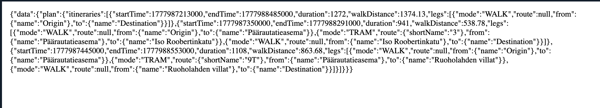

## OmniTransit

Omnitransit is a fast public transport app for Finland. It is built with React Native and Expo. Users can easily plan travel routes, see live maps, and save personal addresses safely. The app works in Helsinki, Tampere, and Turku, all in one simple app.

## Core Features

* **Easy Region Switching:** Quickly switch between Helsinki (HSL) and Waltti networks for Tampere and Turku.
* **GPS:** Uses the device's built-in GPS to fetch the current location.
* **Biometric Security:** Uses Face ID or Touch ID to protect your saved home and work addresses.
* **Saved Data Storage:** Uses `AsyncStorage` to securely save your custom locations on your device.
* **Custom Map System:** Replaces standard Apple or Google Maps with Digitransit’s official high-quality transit map tiles.
* **Smart Route Planning:** Uses GraphQL to find detailed travel routes with walking distances, transport types, times, and exact stop names.

## Tech Stack & Architecture

* **Framework:** React Native / Expo
* **Navigation:** React Navigation (Nested Bottom Tabs & Native Stacks)
* **Hardware APIs:** `expo-location`, `expo-local-authentication`
* **Storage:** `@react-native-async-storage/async-storage`
* **Maps:** `react-native-maps`
* **API:** Digitransit GraphQL API

## Installation & Setup

1. **Clone the repository:**
   ```bash
   git clone [https://github.com/Ghost-137/omniTransit.git](https://github.com/Ghost-137/omniTransit.git)
   cd omnitransit
   ```

2. **Install Dependencies:**
   ```bash
   npm install
   ```

## Run the App

```bash
npx expo start
```


## The Digitransit API 

This application does not rely on basic REST APIs; it utilizes **GraphQL**. GraphQL allows the app to query only the exact data it needs. 

### The Routing Endpoints
Digitransit divides Finland into different routing engines. Omnitransit dynamically swaps these endpoints based on the user's selected region:
* **Helsinki (HSL):** `https://api.digitransit.fi/routing/v2/hsl/gtfs/v1`
* **Tampere & Turku (Waltti):** `https://api.digitransit.fi/routing/v2/waltti/gtfs/v1`

### Geocoding
To convert user text input ("Kamppi") into raw GPS coordinates (Latitude / Longitude), the app uses the Digitransit Geocoding API:
* `https://api.digitransit.fi/geocoding/v1/search?text={QUERY}&size=1`

## How to Test the API in Postman

If you want to test the routing logic outside of the app, you can easily replicate the app's network requests using Postman.

1. **Setup the Request** 
   * **Method:** `POST`
   * **URL:** `https://api.digitransit.fi/routing/v2/hsl/gtfs/v1` (or the `/waltti/` endpoint)

2. **Setup the Headers**
   Go to the Headers Tab and Add:
   * `Content-Type`: `application/json`
   * `digitransit-subscription-key`: `YOUR_API_KEY_HERE`

3. **Write the GraphQL Body**
   Go to the Body tab, select **GraphQL**, and paste the following query:

   ```graphql
   {
     plan(
       from: {lat: 60.1699, lon: 24.9384}
       to: {lat: 60.1610, lon: 24.9338}
       numItineraries: 3
     ) {
       itineraries {
         startTime
         endTime
         duration
         walkDistance
         legs {
           mode
           route { shortName }
           from { name }
           to { name }
         }
       }
     }
   }
   Here is the cleanly formatted Markdown code for your `README.md` file. You can copy the code block below and paste it directly into your project!
```markdown


Hit **Send** to view the structured JSON response detailing the exact transit legs, vehicle modes, and station names.



## References & Documentation

* **Digitransit Developer API:** Primary documentation for the GraphQL routing endpoints, custom map tiles, and geocoding. https://digitransit.fi/en/developers/apis/1-routing-api/
* **Expo Documentation:** Used for accessing native device hardware including `expo-location` and `expo-local-authentication`. https://github.com/expo/expo/tree/main/packages/expo-local-authentication
* **React Navigation:** Used for architecting the nested Stack and Bottom Tab navigators.
* **AsyncStorage:** Used for persistent local data storage.

* **
```